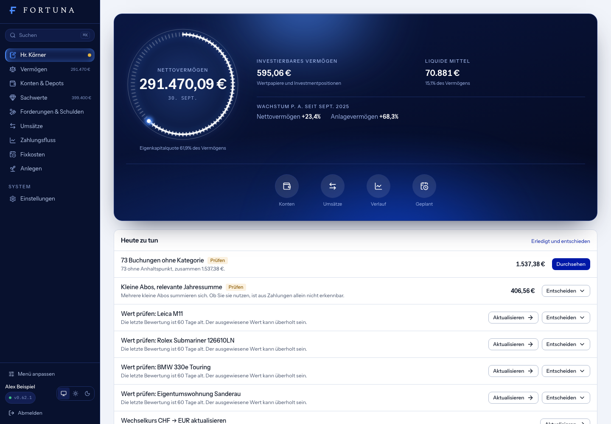
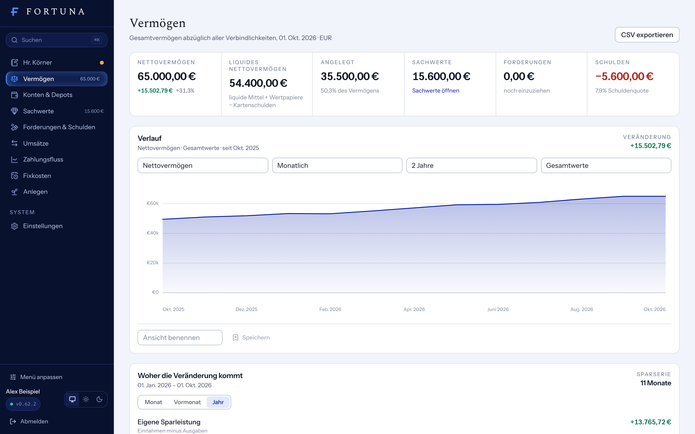

# Fortuna


Public source for a private, single-user finance application.
[All rights reserved](LICENSE), not open source. Financial data and deployed
accounts are not public. See [the publication boundary](docs/publication.md).

Fortuna is a personal-finance and net-worth workspace. It answers four
questions from a single screen: what do I own, what do I owe, where does my
money go, and how is my position changing over time.

It combines bank accounts, credit cards, dedicated cash tracking, transactions with deterministic
categorisation, recurring payments and subscriptions, contracts with encrypted documents,
savings optimizations, a rules-based investment policy and allocation process, cashflow analysis, configurable historical recap,
manually valued assets with valuation history, receivables and
liabilities with balance history, the synced broker depot, net-worth tracking, data quality, global search, CSV
import/export and a scoped MCP endpoint for AI assistants.

Bank connections read information without initiating bank payments. Separately
authorized Scalable trading can submit real orders only after a provider
preview and the owner's explicit confirmation. Trading is not available to
Copilot or MCP. Fortuna is not a public financial service or investment advice.

The built-in **Fortuna Copilot** can use the owner's existing ChatGPT plan via
the official Codex App Server device-code login. The isolated child process
receives a bounded snapshot without IBANs and runs with a restricted read-only
sandbox. Client-executed dynamic tools let it create and update Fortuna records
while the browser request still passes through the session-only mutation
boundary. Deletes, external side effects and bank payments are not exposed. Its renewable authentication state is encrypted in
`external_connections`; raw tokens never reach the browser or application logs.

## Current application screens

These are real captures of Fortuna 0.62.1 from an isolated local database seeded
with fictional financial data. They do not show the author's balances, accounts,
assets, transactions, or investment performance. No bank or broker was connected.
The older images under `fortuna-brand/mockups` are design concepts, not these
screens. See [the publication boundary](docs/publication.md).





## Stack

| Layer | Choice |
| --- | --- |
| Runtime / package manager | Bun |
| Framework | TanStack Start (Vite 8, Nitro) with React 19, TanStack Router and Query |
| API | oRPC procedures validated with Valibot, one router in `src/server/orpc/router.ts` |
| Database | PostgreSQL via Drizzle ORM, migrations in `drizzle/` |
| Auth | better-auth (email + password, sign-up disabled, secure cookies) |
| Styling | Tailwind v4 with the Fortuna brand tokens, Spectral / Instrument Sans / IBM Plex Mono self-hosted |
| Quality | Biome, TypeScript strict, Vitest unit + integration tests |
| Deployment | Docker image on Railway (IaC in `.railway/railway.ts`) with a preDeploy migrator and `/api/health` |

## Getting started

Requirements: Bun 1.4+, PostgreSQL 15+ (local or Docker).

```bash
bun install
cp .env.example .env            # fill DATABASE_URL, BETTER_AUTH_SECRET, OWNER_*
createdb fortuna_dev            # use this isolated local name in DATABASE_URL
bun run db:bootstrap:local      # first setup; historical files commit separately
bun run db:migrate              # applies migrations and creates the owner account
bun run db:seed                 # optional: 14 months of realistic demo data
bun run dev                     # http://localhost:3000
```

Sign in with `OWNER_EMAIL` / `OWNER_PASSWORD`. There is no sign-up page: the
owner account is the only way in, created by the migrator (or the seed) from
the environment.

The seed replaces demo-owner data and is restricted to local `fortuna_dev`,
`fortuna_test`, or `fortuna_demo_*` databases outside production. Use a disposable
database, fictional owner identity, and newly generated local secrets. Never
copy production configuration or bank/broker credentials.

### Environment variables

| Variable | Required | Purpose |
| --- | --- | --- |
| `DATABASE_URL` | yes | PostgreSQL connection string. Railway's Postgres plugin injects it. |
| `BETTER_AUTH_SECRET` | yes | At least 32 random characters (`openssl rand -hex 32`). Signs sessions and derives the key that encrypts stored bank-provider secrets. Rotating it invalidates sessions and stored provider tokens. |
| `BETTER_AUTH_URL` | yes in production | Public base URL, e.g. `https://fortuna.example.com`. Used for cookies, trusted origins and MCP host validation. |
| `AUTH_TRUSTED_ORIGINS` | no | Comma-separated extra origins allowed to call the auth endpoints. |
| `OWNER_EMAIL`, `OWNER_PASSWORD`, `OWNER_NAME` | first deploy | Owner account created by `db:migrate` when it does not exist. Password: 12+ characters. |
| `MCP_BEARER_TOKEN` | no | Enables the read-only MCP endpoint at `/api/mcp` when set to 32+ random characters. |
| `OBJECT_STORAGE_ENDPOINT`, `OBJECT_STORAGE_REGION`, `OBJECT_STORAGE_BUCKET` | no | S3-compatible private storage for encrypted documents. If omitted, Fortuna keeps using the encrypted PostgreSQL fallback. |
| `OBJECT_STORAGE_ACCESS_KEY_ID`, `OBJECT_STORAGE_SECRET_ACCESS_KEY` | with object storage | S3-compatible credentials. Keep them server-side and inject them through Railway references. |
| `OBJECT_STORAGE_FORCE_PATH_STYLE` | no | Set to `true` only for S3-compatible providers that require path-style URLs. |
| `LOG_LEVEL` | no | `debug`, `info` (production default), `warn`, `error`. |
| `DATABASE_CONNECTION_TIMEOUT_MS`, `DATABASE_QUERY_TIMEOUT_MS` | no | Pool timeouts (defaults 5 s / 15 s). |

No OpenAI API key is required for the Copilot. The owner connects a ChatGPT
account from the Copilot page and usage follows that account's plan limits.
The bookkeeping review applies deterministic matches based on existing owner
decisions. Ambiguous proposals remain unselected until the owner confirms them.
Copilot can explain and edit allowed domain records on request.
Responses render safe GitHub-Flavored Markdown. The assistant addresses the
owner formally by last name, highlights bookkeeping questions, supports copy,
retry and local chat reset, and keeps the actual financial mutations in the
same validated Fortuna service layer.
Explicitly stated durable preferences, naming conventions and domain rules are
stored as editable Copilot memories. Corrections replace an existing memory by
stable key; structured finance data remains in its own tables instead.
Chat messages accept images, PDFs and bounded text/data files through selection,
drag and drop, or clipboard paste. Uploads are same-origin and session-only,
stored in private temporary directories, scoped to the owner and removed after
successful use or a 30-minute expiry. Poppler extracts PDF text and renders a
small image fallback for scanned pages.

## Development workflow

| Command | What it does |
| --- | --- |
| `bun run dev` | Dev server with HMR on port 3000 |
| `bun run verify` | Biome check, typecheck, unit tests, production build |
| `bun run test` | Unit tests for the domain layer (`tests/*.test.ts`) |
| `bun run test:integration` | Flows against a real PostgreSQL (`tests/integration/`); reads `DATABASE_URL` from `.env` |
| `bun run db:generate` | Generate a migration after editing `src/server/db/schema.ts` |
| `bun run db:migrate` | Apply migrations and ensure the owner account |
| `bun run db:bootstrap:local` | Initialize an isolated local database with unchanged historical migrations |
| `bun run db:seed` | Load the demo dataset (wipes the owner's data first) |
| `bun run db:reset` | Drop and recreate the development database (refuses in production) |
| `bun run build` / `bun run start` | Production build to `.output/` and run it |

The route tree (`src/routeTree.gen.ts`) is generated by the Vite plugin while
the dev server runs, or by `bun run generate-routes`.

## Architecture

```
browser (React, TanStack Router + Query)
   │  oRPC over /api/rpc            /api/auth (better-auth)   /api/export/*  /api/mcp
   ▼
src/server/orpc/router.ts           one typed router; `authed` = read, `mutation` = session only
   ▼
src/server/services/*               all database access, one file per domain, userId-scoped
   ▼                                 ▲
src/domain/*                        pure financial logic, no I/O, unit-tested
   ▼
src/server/db (Drizzle, PostgreSQL)

src/server/providers/bank/*         Enable Banking client → normalised accounts/transactions → insertTransactions
```

Every write of transactions, whether from CSV, a provider sync, manual entry or
the seed, goes through `insertTransactions`, which deduplicates, applies rules,
upserts merchants, links recurring payments, pairs internal transfers and rolls
the account balance forward. A provider outage therefore never affects data
already in Fortuna.

Enable Banking credentials are uploaded once under **Verbindungen**. The same
page lists supported German institutions, starts the PSD2 authorization flow
and imports the authorized accounts after the registered callback returns.
Subsequent syncs reuse the authorized session and follow all transaction pages.

Cash account pages support deposits, expenses, and counted-balance corrections.
These movements still use the central transaction
write path and therefore participate in categorisation, cashflow and net worth.

### Database model

- `user`, `session`, `account`, `verification` (better-auth) and
  `user_settings` (base currency, locale, analysis window).
- `accounts` with `account_balances` (dated observations),
  `bank_connections` (encrypted connection secrets) and
  `provider_credentials` (encrypted application private keys).
- `transactions` with `merchants`, `categories` (two levels),
  `categorization_rules`, `recurring_payments` and `import_jobs`.
  Unique per account on `(external_id)` and on the content `fingerprint`.
  Both legs of an internal transfer share `transfer_group_id`.
- `assets` with `asset_valuations`; `receivables` with
  `receivable_balances`; `liabilities` with `liability_balances`; `fx_rates`.
- `investment_source_accounts`, `investment_source_positions` and
  `investment_source_transactions` hold the synced broker depot.
- `contracts` with encrypted `contract_documents`;
  `copilot_memories` for explicit durable preferences and rules;
  `copilot_threads` for the current resumable Herr-Körner conversation.
- `financial_profiles` stores the owner's goal (name, amount, date), savings
  rate, minimum reserve, reserve months and target split (equity, bonds,
  cash, other), next to Hr. Körner's alert preferences.
- Unused since 0.59.0 and kept only until the owner confirms their drop:
  `budgets`, `scenarios`, `scenario_rules`, `account_projections`,
  `securities`, `security_prices`, `investment_positions`,
  `scalable_market_closes`, `investment_sync_runs`, `investment_policies`,
  `instrument_profiles` and `investment_decisions`. Nothing reads or writes
  them.

All money columns are integer minor units (`*_minor`); quantities and prices
are `numeric`. Every amount has an explicit currency.

### Investment process

"Anlegen" (`src/domain/capital-advice.ts`) is a deterministic proposal, not a
product recommendation. The reserve is one rule (`src/domain/reserve.ts`):
reserve months times monthly expenses, or the minimum reserve if larger, with
the monthly figure taken from full months of bookings only. A dip the
forecast sees below the reserve stays liquid too. Bank money above that
becomes a transfer ticket the owner carries out; free money is bought by the
gap of each class to the owner's target split, only into instruments already
in the depot, and never by selling. Recent market performance never enters.

The process is grounded in the SEC/Investor.gov guidance on
[asset allocation, diversification and rebalancing](https://www.investor.gov/additional-resources/general-resources/publications-research/info-sheets/beginners-guide-asset),
[ESMA's suitability requirement](https://www.esma.europa.eu/publications-data/questions-answers/1765)
to connect risk tolerance and ability to bear losses with the investor's
objective and financial situation, ESMA's work on the
[material long-term effect of costs](https://www.esma.europa.eu/press-news/esma-news/esma-report-stresses-impact-costs-retail-investor-benefits),
and the German Verbraucherzentrale guidance on
[risk capacity, asset classes and broad diversification](https://www.verbraucherzentrale.de/wissen/geld-versicherungen/sparen-und-anlegen/bevor-sie-geld-anlegen-das-kleine-einmaleins-der-geldanlage-10622).

### Metric definitions

Computed in `src/domain/net-worth.ts` and `src/domain/cashflow.ts` from
point-in-time values converted into the base currency:

- **Cash**: positive balances of current, savings and cash accounts, plus a
  provider-reported broker cash balance where available. Buying power and
  credit limits are not cash.
- **Investments**: investment account balances and the provider-reported
  broker portfolio value or valued provider holdings. Imported cost values can be
  estimates but still count. Quantity alone without a monetary value does not.
- **Provider precedence**: the official CLI snapshot takes priority over a
  row left by the removed CSV import. An explicitly linked manual account is
  suppressed to prevent double counting.
  Current provider values are not back-cast into earlier historical months.
- **Physical assets**: the latest valuation of each active asset.
- **Receivables**: the latest outstanding balance that another person owes the
  owner.
- **Liabilities**: negative account balances (credit cards, overdrafts) plus
  liability rows that are not mirrored by an account.
- **Net worth** = cash + investments + physical assets + receivables − liabilities.
- **Liquid net worth** = cash + investments − credit-card/overdraft balances.
- **Income / expenses**: booked transactions excluding internal transfers,
  categories of kind `transfer` and pending rows. Children roll up into their
  parent category. Savings rate = (income − expenses) / income.
- **Forecast**: liquid balance projected day by day from today with three
  separately reported layers: scheduled (pending transactions, certain),
  recurring (active recurring items by cadence, estimated) and irregular
  (average daily net of the remaining history, uncertain, with a widening
  band).
- **Optimizations**: current monthly cost minus an alternative, projected over
  one, three and five years after one-time switching costs. Potential savings
  never count as cash or net worth; completed missions track a time-proportional
  realized amount for motivation and reporting.

History is reconstructed, not snapshotted: an account balance at a date is the
nearest observation adjusted by booked transactions; assets, receivables and
liabilities use the newest history row at or before the date. Amounts in a
currency without a stored rate are excluded and the UI says so.

## Importing data

**CSV**: Imports → choose the account and file → the header is mapped
automatically (German and English bank exports, `;` or `,`, `1.234,56` or
`1,234.56`, separate debit/credit columns) and can be corrected → import.
Re-importing the same file skips existing rows.

**Bank connections**: Enable Banking is the only bank adapter. Its client and
key handling live in `src/server/providers/bank/`; nothing outside that folder
talks to a bank API. The generic adapter registry and its credential-free demo
provider were removed in 0.20.6 — the demo wrote synthetic transactions into
the real database and was never usable in production.

**Market data**: the broker depot is valued by the Scalable sync. Hand-entered
securities, prices and positions were removed in 0.59.0.

**Remise**: the connections page starts a public OAuth client with PKCE against
the hosted Remise MCP server and requests only `remise:read`. Access and refresh
tokens are encrypted in `external_connections`. A sync imports active inventory
as physical assets in the `Remise` section, using the internal target price or
approved asking price, and records later changes as market valuations.

**Kataster**: paste a read-only MCP token from Kataster Settings under
**Verbindungen**. Fortuna verifies it before storing it encrypted, then reads the
current monthly cost, billed amount, margin, readiness and operating status.
These figures appear under Verbindungen and Optimierung but never enter personal
accounts or net worth.

## MCP (AI access)

Set `MCP_BEARER_TOKEN` and point an MCP client at `https://<host>/api/mcp`
with `Authorization: Bearer <token>`. Tools: `get_accounts`,
`get_account_balances`, `get_transactions`, `search_transactions`,
`get_categories`, `get_spending_by_category`, `get_recurring_payments`,
`get_cashflow`, `get_cashflow_forecast`, `get_assets`, `get_asset_valuations`,
`get_receivables`, `get_optimizations`, `get_contracts`,
`get_data_quality`, `get_recap`,
`get_liabilities`, `get_investments`, `get_investment_process`, `get_net_worth`, `get_net_worth_history`,
`get_net_worth_at`, `get_asset_allocation`, `search`.

The environment token is always read-only. Named, hashed, revocable tokens are
created in Settings and may have explicit write scope restricted to the reviewed
domain-record tool allowlist. Browser-only mutations, provider credentials,
Copilot execution, and broker trading remain unavailable to MCP.
Requests are rate-limited and host/origin
checked against `BETTER_AUTH_URL`.

## Security

- better-auth with email + password, sign-up disabled, 12-character minimum,
  session cookies `HttpOnly`/`Secure`/`SameSite`, 14-day sessions refreshed
  daily, login rate limiting.
- Server functions carry TanStack Start's CSRF middleware; every response
  gets `X-Frame-Options: DENY`, `nosniff`, a strict referrer policy and a
  permissions policy.
- All input is validated with Valibot at the procedure boundary; all queries
  are parameterised through Drizzle and scoped to the session's user id.
- Bank-provider secrets and uploaded application private keys are encrypted at
  rest with AES-256-GCM using a key derived (HKDF) from
  `BETTER_AUTH_SECRET`. Private keys are accepted only through a bounded,
  same-origin, session-authenticated upload and are never returned to clients.
- Logs are structured JSON in production; key-name and pattern redaction keeps
  passwords, tokens, connection strings and IBANs out of them.
- No third-party analytics, fonts are self-hosted, `robots: noindex`.

## Deployment (Railway)

The project is defined as Railway infrastructure-as-code in
`.railway/railway.ts`: a PostgreSQL service and the `fortuna-app` service
built from the Dockerfile on the `main` branch of the GitHub repo, with
`bun src/server/db/migrate.ts` as the pre-deploy step (migrations + owner
account), `bun .output/server/index.mjs` as the start command and
`/api/health` as the health check, served at https://fortuna.pdcd.net (CNAME in the
pdcd.net Route 53 hosted zone pointing at the Railway edge). Every push to
`main` deploys.

1. `railway config plan` shows the difference between the file and the
   live project; `railway config apply` applies it after review.
2. Set the secrets in the Railway service (they are `preserve()`d in source):
   `BETTER_AUTH_SECRET`, `BETTER_AUTH_URL` (the public URL), `OWNER_EMAIL`,
   `OWNER_PASSWORD`, `OWNER_NAME` and optionally `MCP_BEARER_TOKEN`.
   The IaC file also creates the private `fortuna-files` bucket and injects its
   S3-compatible credentials into the app through resource references.
3. Push to `main`. The migrator aborts the deployment on failure, so the
   previous release keeps serving.

Any Docker host works the same way: run the migrator once with the same
environment, then start the image.

The historical chain needs per-file commits for an empty database. Bootstrap
an isolated local database first with `db:bootstrap:local`. Existing production
databases continue through `db:migrate`; do not rewrite applied SQL or rotate
the encryption secret as part of publication.

### Backup and restore

```bash
DATABASE_URL=... scripts/backup-postgres.sh /backups/fortuna-$(date +%F).dump
DATABASE_URL=... scripts/restore-postgres.sh /backups/fortuna-2026-09-14.dump
```

Backups are `pg_dump` custom-format archives and contain everything, including
encrypted provider secrets (which only decrypt with the same
`BETTER_AUTH_SECRET`). Keep the secret with the backup, store both encrypted,
and test a restore into an empty database before relying on it. Railway's
Postgres service additionally offers its own volume backups. CSV exports of
transactions, assets, liabilities and net-worth history are available under
Imports & export.

## Testing

- `tests/*.test.ts`: money and FX, dates, normalisation and dedupe
  fingerprints, rules, transfer pairing, recurring detection, cashflow,
  forecast, net worth, CSV parsing.
- `tests/integration/finance-flows.test.ts`: idempotent CSV import with rules,
  balance roll-forward, transfer pairing and its exclusion from cashflow,
  manual categorisation surviving rules and spawning a rule, recurring
  detection, net worth from valuation and balance history at different dates,
  explicit transfer linking and observed balances.

## Known limitations

- Minor units are always treated as two decimals (JPY-style currencies work
  but display with two decimals).
- No market-data adapter is bundled; only the Scalable depot is valued.
  Enable Banking is the only bank adapter, and CSV import remains available for every account.
- The forecast uses a simple average of irregular spending; it is honest about
  uncertainty but not clever.
- One owner account per deployment; the data model is user-scoped so this can
  grow, but there is no invitation flow by design.
